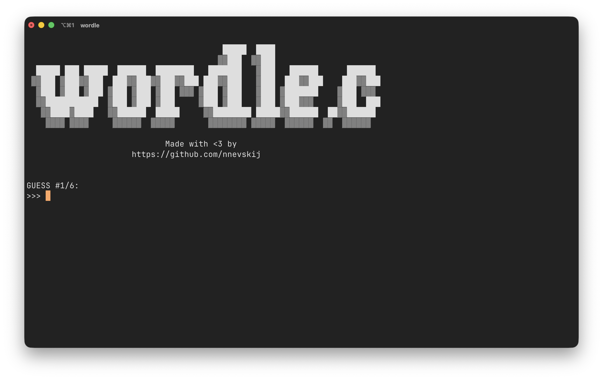

# wordle.c

Wordle game written in C in less than 200 loc.


### Getting started
Clone the repository by running
```bash
git clone https://github.com/enricocristaudo/wordle.c.git
```

Then, compile:
```zsh
cd wordle.c
gcc wordle.c -o wordle
```

And run:
```zsh
./wordle
```

### Advanced options
You can customize the game difficulty using flags:
- `-s [number]`: Set the lenght of the word to guess.
- `-a [number]`: Set the maximum Attempts.
- `-it`: Set dictionary to italian.

By default, wordle will run in with 5 characters long english words.